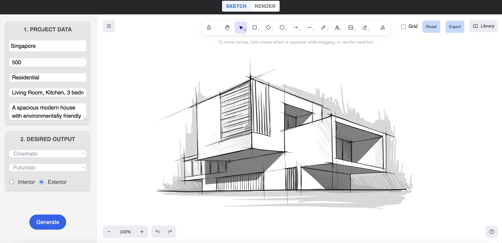

# Architect AI Design Tool

Welcome to the Architect AI Design Tool repository on GitHub! This web application is designed by architects for architects, aiming to enhance design ideation through technology. Users can sketch their visions, input project parameters, and receive AI-generated narratives and visual renderings for their design proposals.

## Features

- **Excalidraw Integration**: Leverage @excalidraw/excalidraw for an intuitive sketching experience to flesh out design ideas.
- **AI-Driven Insights**: Input design parameters to receive narratives and visual renderings generated by AI, leveraging OpenAI and Stability AI.
- **Interactive UI**: A sleek, user-friendly interface built using React, Vite, and Tailwind CSS.




## Getting Started

These instructions will get you a copy of the project up and running on your local machine for development and testing purposes.

### Prerequisites

Before you start, ensure you have the following installed:

- Node.js (LTS Version)
- npm (Node Package Manager)

### Installation

To set up the project locally, follow these steps:

1. **Clone the Repository**

```
git clone https://github.com/vigneshkaushik/Project-Draco.git
cd Project-Draco
```

2. **Install Client Dependencies**
   Navigate to the client directory and install the necessary packages:

```
cd client
npm install axios form-data uuid
npm install tailwindcss -D
```

3. **Install Server Dependencies**
   In a new terminal window, navigate to the server directory and set up the server-side packages:

```
cd server
npm install body-parser cors dotenv express form-data fs multer node-fetch nodemon openai uuid
```

4. **Environment Setup**
   In the server directory, create a .env file to store your API keys:

```
OPENAI_API_KEY=your_openai_api_key_here
STABILITY_API_KEY=your_stability_ai_api_key_here
```

Replace your_openai_api_key_here and your_stability_ai_api_key_here with your actual OpenAI and Stability AI API keys, respectively.

### Running the Application

To run the application, you'll need to start both the client and the server.

- **Start the Client**
  From the client directory:

```
npm run dev
```

This will launch the Vite development server, and your client should be accessible at http://localhost:5173.

- **Start the Server**
  From the server directory:

```
npm run dev
```

This will start the backend server using nodemon, which will be accessible at http://localhost:8000.

## Usage

Once both servers are running, navigate to http://localhost:5173 in your browser to start designing. Use Excalidraw to sketch your initial designs and input the parameters to receive AI-generated design proposals.

## License

This project is licensed under the MIT License.

## Acknowledgments

- OpenAI for providing the API used for generating text narratives.
- Stability AI for the image generation capabilities.
- Singapore Institute of Architects for organizing this hackathon.
